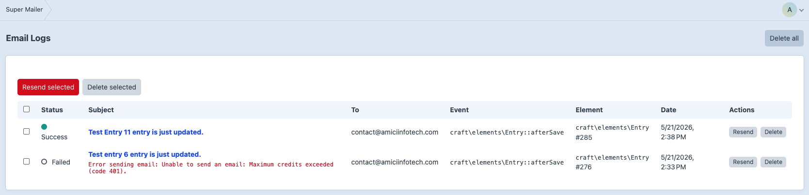
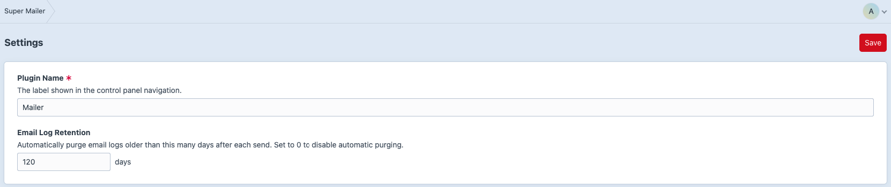

# Control Panel Guide

## Notifications

Go to **Super Mailer -> Notifications** to manage notification elements.

From the element index you can:

- Create notifications.
- Edit existing notifications.
- Duplicate notifications.
- Enable or disable notifications.
- Delete notifications.
- View trashed notifications and restore them.
- Open preview pages.

## Notification Editor

The notification editor includes:

- Title and handle.
- Event picker with searchable event class/constant/name.
- Example listener code.
- Available callback variables.
- Event-aware condition match mode and condition rows.
- Optional PHP condition.
- Recipient fields.
- Sender and reply-to fields.
- Subject.
- HTML and plain text template paths.
- Recent run history.
- Enabled lightswitch.
- Preview link.

## Preview

The preview page shows:

- Rendered subject.
- Rendered recipients.
- Test send form.
- Condition debug table.
- HTML and plain text rendered output.
- Template variables.
- Raw queue context.

Use `?id=123` on the preview URL to preview against a specific matching element ID.

Condition rows in the editor are generated from the selected event. They can include selectors for known options, user pickers, custom field layout options, toggles, and drag handles for reordering rows.

## Logs

Go to **Super Mailer -> Logs** to review the latest send attempts.

From the log index you can:

- View success/failure status.
- Inspect subject, recipient, event, and element info.
- Open a log detail page.
- Resend one or multiple logs.
- Delete one, selected, or all logs.

## Settings

Go to **Super Mailer -> Settings** to configure:

- Plugin name shown in the CP navigation.
- Email log retention days.

## Permissions

Use:

- `super-mailer:view-notifications` for read-only access.
- `super-mailer:manage-notifications` for authoring, deleting, resending, and settings management.
