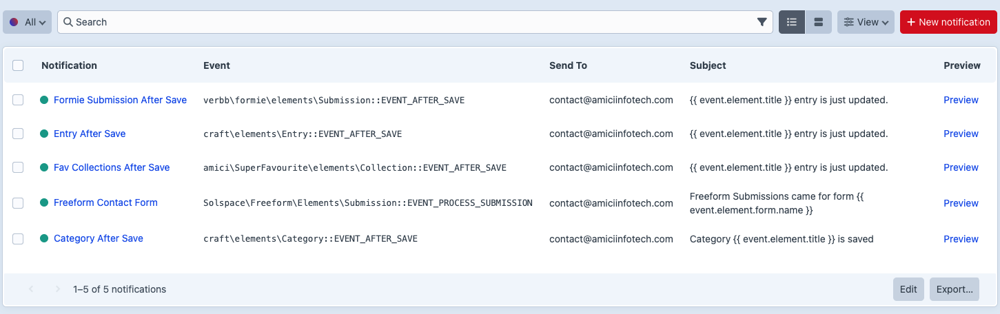

# Control Panel Guide

## Notifications

Go to **Super Mailer -> Notifications** to manage notification elements.

From the element index you can:

- Create notifications.
- Edit existing notifications.
- Duplicate notifications.
- Enable or disable notifications.
- Delete notifications.
- View trashed notifications and restore them.
- Open preview pages.

## Notification Editor

The notification editor includes:

[Screenshot for Notification Editor]
Add a screenshot of a saved notification edit page showing title/handle, selected event, conditions, recipient fields, template paths, enabled sidebar, preview link, and recent runs.

- Title and handle.
- Event picker with searchable event class/constant/name.
- Example listener code.
- Available callback variables.
- Condition match mode and condition rows.
- Optional PHP condition.
- Recipient fields.
- Sender and reply-to fields.
- Subject.
- HTML and plain text template paths.
- Recent run history.
- Enabled lightswitch.
- Preview link.

## Preview

The preview page shows:

[Screenshot for Preview Page]
Add a screenshot of the notification preview page showing the summary header, recipient preview, test send form, condition debug table, rendered message, template variables, and raw context sections.

- Rendered subject.
- Rendered recipients.
- Test send form.
- Condition debug table.
- HTML and plain text rendered output.
- Template variables.
- Raw queue context.

Use `?id=123` on the preview URL to preview against a specific matching element ID.

## Logs

Go to **Super Mailer -> Logs** to review the latest send attempts.

[Screenshot for Logs Index]
Add a screenshot of **Super Mailer -> Logs** showing success/failed rows, subjects linked to detail pages, recipient/event/element columns, and resend/delete actions.

From the log index you can:

- View success/failure status.
- Inspect subject, recipient, event, and element info.
- Open a log detail page.
- Resend one or multiple logs.
- Delete one, selected, or all logs.

## Settings

Go to **Super Mailer -> Settings** to configure:

[Screenshot for Settings Page]
Add a screenshot of **Super Mailer -> Settings** showing plugin name and email log retention fields.

- Plugin name shown in the CP navigation.
- Email log retention days.

When Craft's `allowAdminChanges` config setting is false, the settings screen follows Craft's read-only pattern and disables editing.

[Screenshot for Read-Only Settings Page]
Add a screenshot of the settings page when `allowAdminChanges` is false, showing Craft's "Changes to these settings aren't permitted in this environment." notice and disabled fields.

## Permissions

Use:

- `super-mailer:view-notifications` for read-only access.
- `super-mailer:manage-notifications` for authoring, deleting, resending, and settings management.
