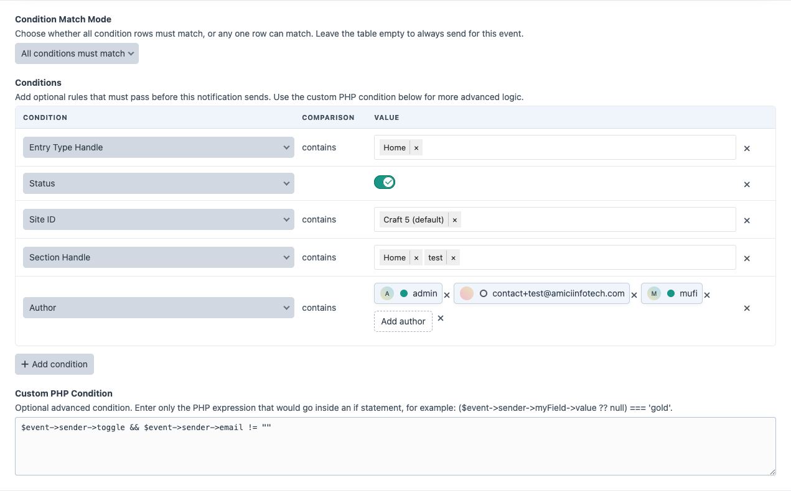

# Events and Conditions

## Supported Events

Super Mailer lists content-related Craft events and supported plugin events.

Common examples:

- `craft\services\Elements::EVENT_AFTER_SAVE_ELEMENT`
- `craft\services\Elements::EVENT_AFTER_DELETE_ELEMENT`
- Third-party form submission element save events.
- Third-party submission processing events.

The event list is generated from installed Craft/plugin classes, so available options depend on the project.

## Event Variables

The event picker shows PHP callback variables for the selected event. Super Mailer exposes the selected event's available `$event` data to email templates through the Twig `event` variable when that data can be normalized or rehydrated.

PHP condition example:

```php
$event->sender instanceof \craft\base\Element
```

Twig template example:

```twig
{{ event.element.title ?? event.sender.title ?? null }}
```

Exact available properties depend on the event you select. Use the preview page's **Template Variables** panel to confirm what can be used for that notification.

## Condition Rows

Condition rows are evaluated before a queue job is pushed.



Available fields:

- **Status**: enabled/disabled element state.
- **Is New**: whether Super Mailer considers the event a new element/content event.
- **Site ID**: element site ID.
- **Section Handle**: entry section handle; only shown for Entry events.
- **Entry Type Handle**: entry type handle; only shown for Entry events.
- **Author**: one or more Craft users.

## Match Mode

Use **All conditions must match** when every row must pass.

Use **Any condition can match** when at least one row can pass.

## Author Conditions

Author conditions can include multiple users. The saved value is a comma-separated ID list and the condition uses `contains`.

## Status Conditions

Craft entries can return statuses such as `live`, while other element types may return `enabled`. Super Mailer normalizes these values for enabled/disabled comparisons.

Normalized enabled values:

```text
enabled, true, 1, yes, on, live
```

Normalized disabled values:

```text
disabled, false, 0, no, off
```

## PHP Conditions

Use PHP conditions for advanced checks that cannot be expressed with condition rows. Enter only the expression:

```php
($event->sender->siteId ?? null) === 1
```

Super Mailer evaluates the expression as a boolean. Failed PHP conditions are logged as warnings and treated as false.

## Draft and Revision Filtering

Super Mailer ignores drafts, revisions, derivative elements, and provisional drafts for element events. This prevents sends when Craft creates draft/provisional records during editing.

## Condition Debug

The preview page includes a condition debug table showing:


- Field.
- Expected value.
- Actual value.
- Pass/fail result.

PHP conditions are evaluated against the live event object when the actual event fires, so preview shows a note for PHP conditions rather than executing them against a synthetic preview object.
