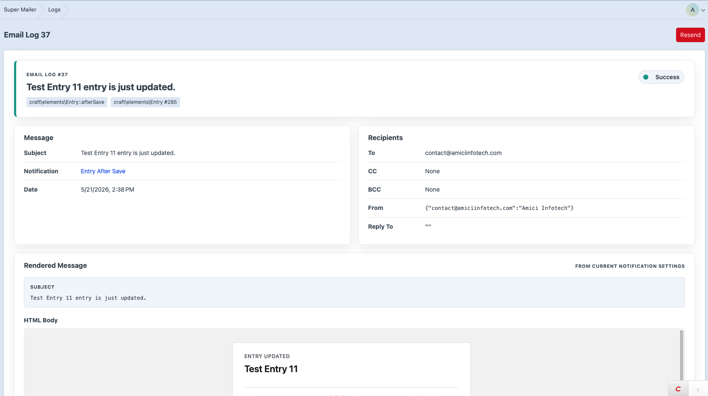
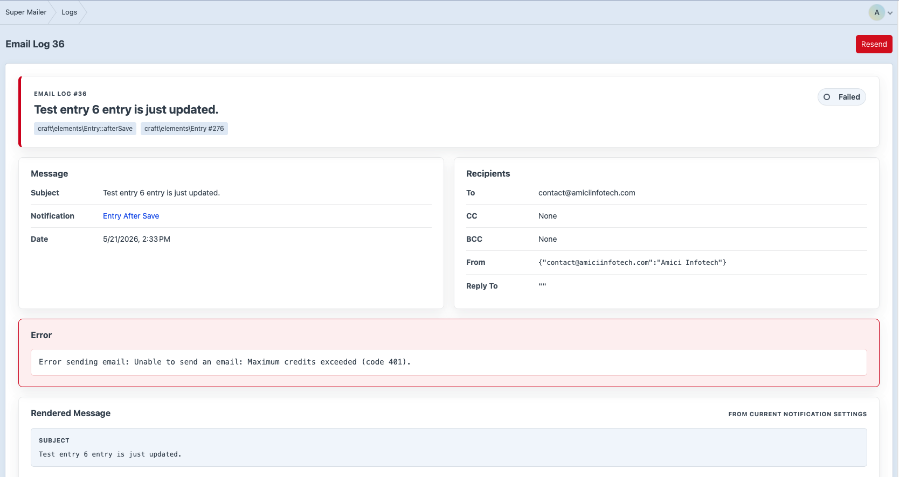

# Logs and Resending

Super Mailer records each email send attempt.

## Log Index

Go to **Super Mailer -> Logs**.


The log index shows:

- Status.
- Subject.
- To recipients.
- Event class/name.
- Element class and ID.
- Date.
- Row actions.

Click the subject to open the detail page.

## Log Detail

The detail page shows:





- Status summary.
- Event and element reference.
- Notification link when available.
- Message metadata.
- Recipients.
- Error trace when failed.
- Rendered subject/body from current notification settings.
- Stored event context.

Rendered output is recalculated from the stored event context and current notification settings. If the notification has been deleted, only stored log data is available.

## Resend

You can resend:

- A single log from the index.
- A single log from the detail page.
- Selected logs from the index.

Resends are queued through Craft's queue and use the original stored event context.

## Delete Logs

You can delete:

- A single log.
- Selected logs.
- All logs.

Log deletes are permanent.

## Automatic Retention

Set **Email Log Retention** under **Super Mailer -> Settings**.

If the value is greater than `0`, Super Mailer purges logs older than that many days after each send.

## Console Purge

Purge by configured retention:

```bash
php craft super-mailer/logs/purge
```

Purge all logs:

```bash
php craft super-mailer/logs/purge-all
```

## Failure Details

Failed sends can include:

- Template render errors.
- Mailer exceptions.
- Recent Craft mailer errors when `send()` returns false.
- Stack traces for caught exceptions.
