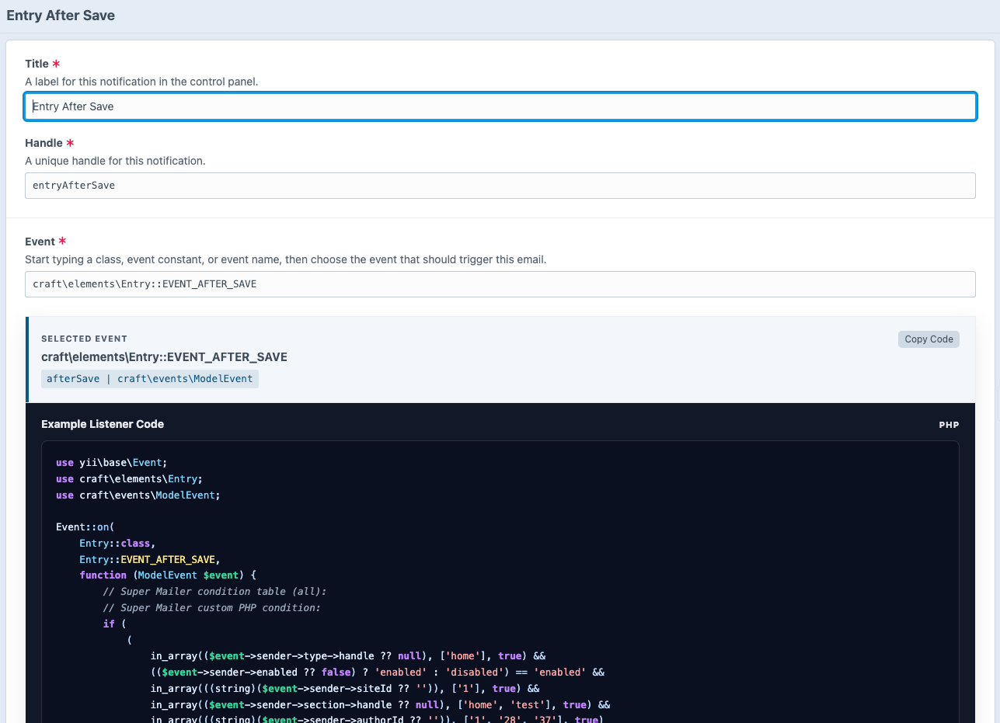
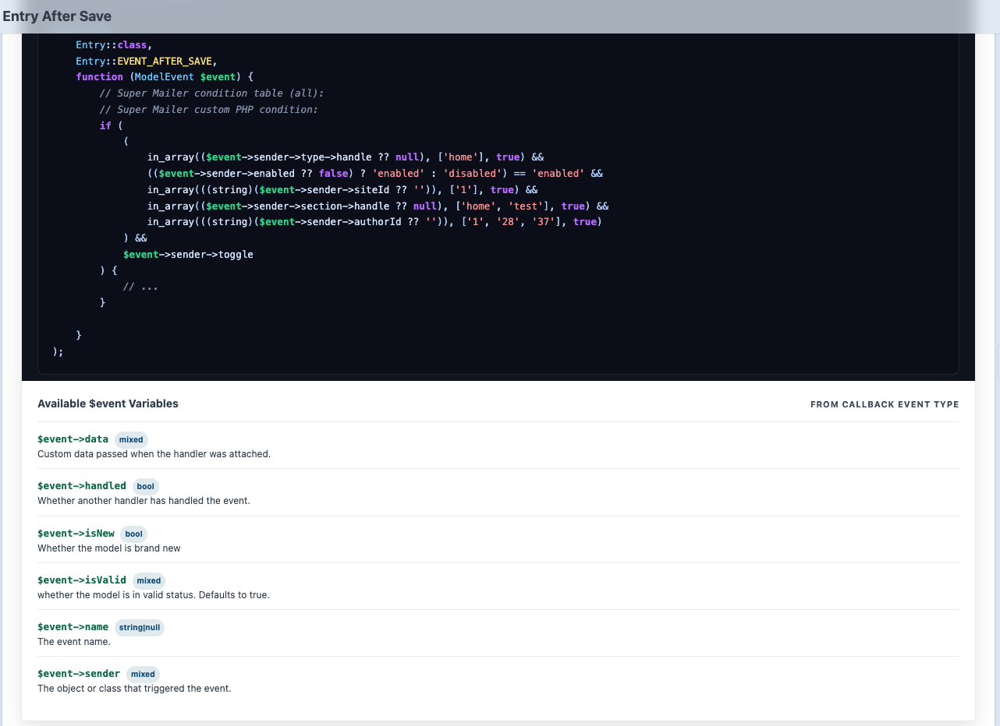
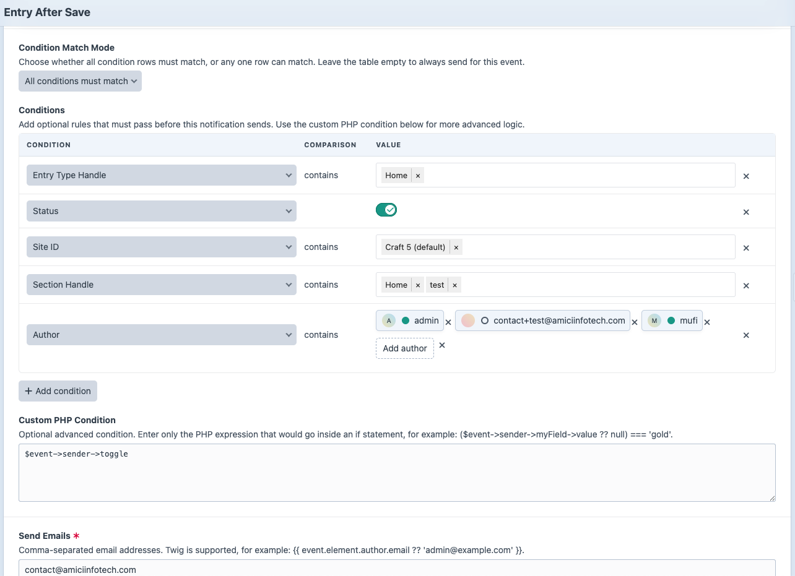
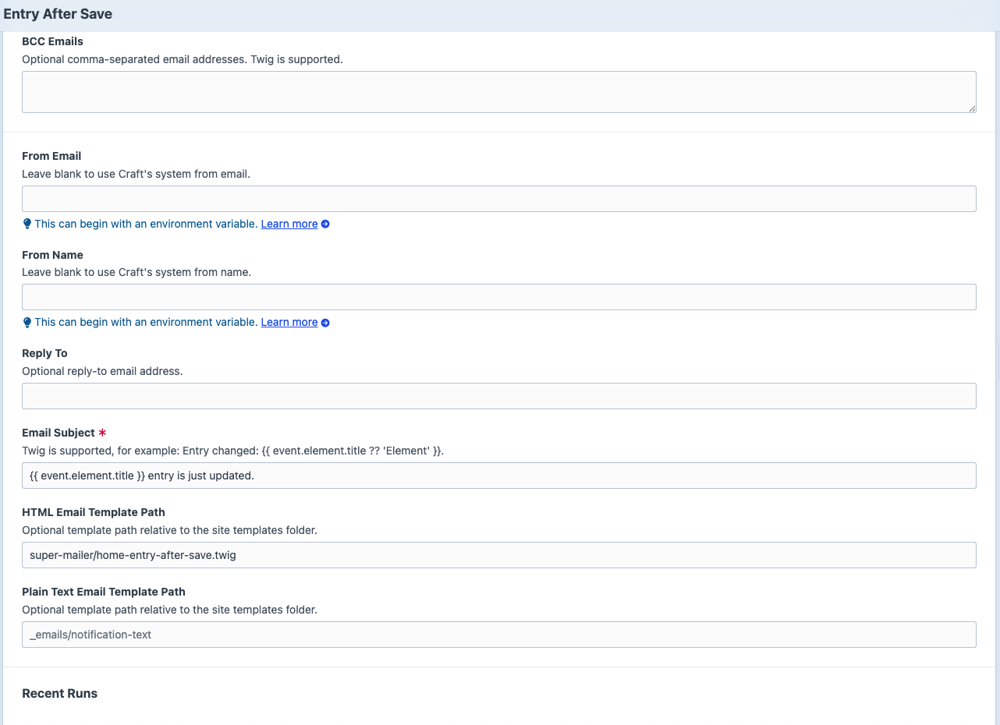
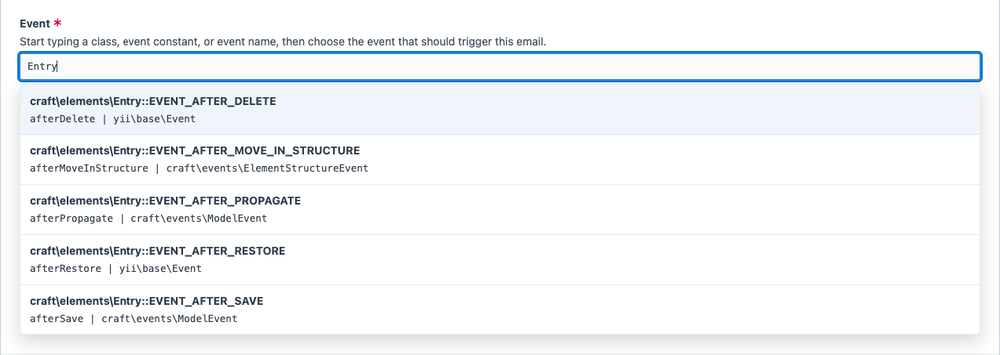
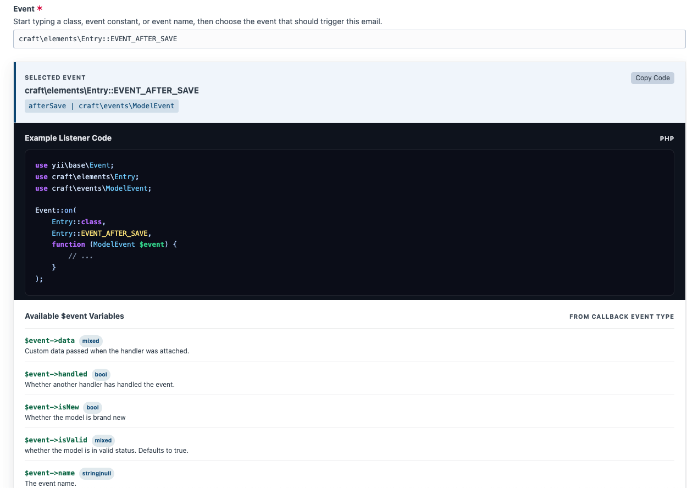

# Creating Notifications

## Basic Notification









1. Go to **Super Mailer -> Notifications**.
2. Click **New Notification**.
3. Enter a title.
4. Choose an event.
5. Enter recipients.
6. Enter a subject.
7. Add an HTML template path, a plain text template path, or both.
8. Save.
9. Open **Preview**.
10. Send a test email.
11. Enable the notification.

## Event Picker

Start typing a class name, event constant, or event name.



Examples:

```text
craft\services\Elements::EVENT_AFTER_SAVE_ELEMENT
vendor\package\elements\Submission::EVENT_PROCESS_SUBMISSION
```

The selected event controls which event is registered and what context will be available.



## Conditions

The condition table changes based on the selected event. Super Mailer shows filters that are useful for that event and hides internal values that are unlikely to be valid notification rules.

Depending on the selected event, condition rows may include:

- Element status, site, and new-event checks.
- Entry section, entry type, and author selectors.
- Category group selectors.
- Custom field layout filters with configured field options.
- Submission form, status, and user filters.
- Commerce product type, store, order status, customer, plan, gateway, and simple boolean filters.

Rows support `is`, `is not`, `contains`, and `does not contain` where appropriate. Toggle rows use a switch instead of a comparison dropdown. Use the move handle to reorder rows for readability.

## Recipients

Recipient fields accept comma-separated email addresses:

```text
admin@example.com, support@example.com
```

Twig is supported:

```twig
{{ event.element.author.email ?? 'fallback@example.com' }}
```

## Sender and Reply-To

Leave **From Email** and **From Name** blank to use Craft's system email settings.

Use **Reply To** when the selected event exposes an email address that should receive replies:

```twig
{{ event.element.email ?? null }}
```

## Templates

Template paths are relative to the Craft site templates folder:

```text
super-mailer/contact-form-submission
_emails/entry-updated
```

You can configure HTML, plain text, or both.

## Enable and Disable

Disabled notifications do not register active sends. Use the element index status action or the editor details sidebar.

## Duplicate

Duplicate an existing notification to reuse event, recipient, condition, and template settings. The copied notification receives a unique title and handle.

## Delete and Restore

Notifications are Craft elements and use Craft's soft-delete flow. Deleted notifications can be restored from the trashed source in the element index.
