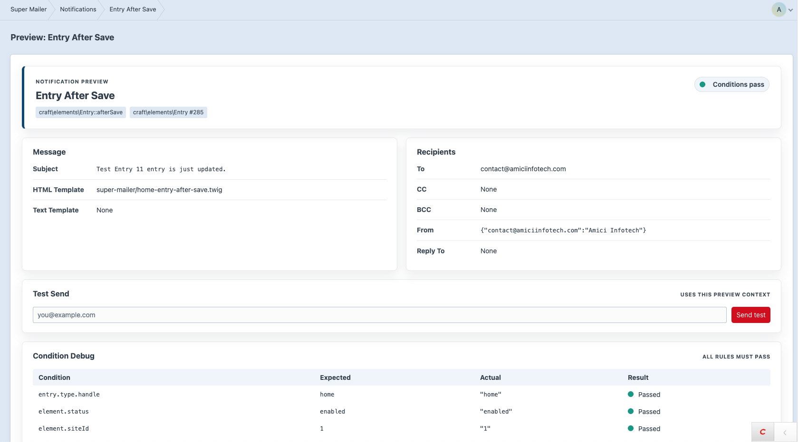
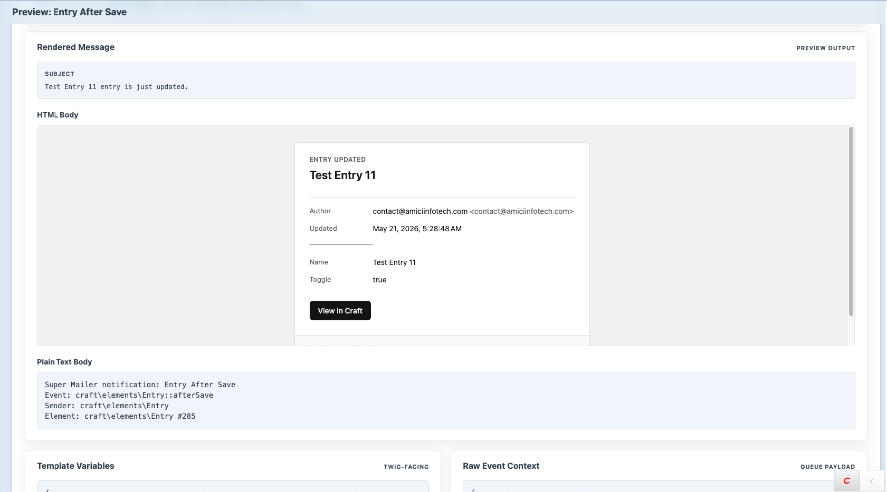
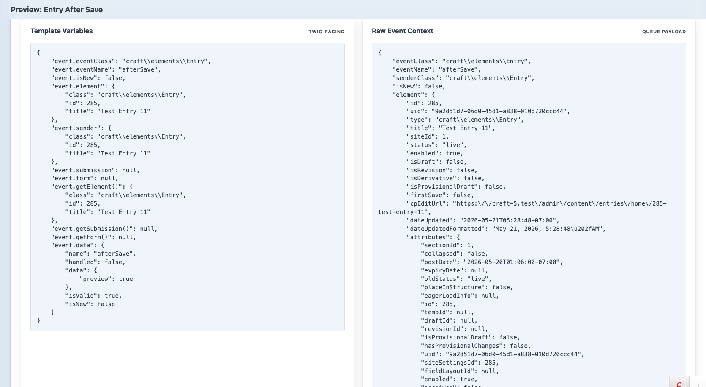

# Preview and Test Send

Preview helps verify a notification before enabling it.

## Open Preview

From a saved notification:

1. Open the notification editor.
2. Click **Preview email** in the sidebar.

Or open:

```text
/admin/super-mailer/notifications/123/preview
```







## Preview a Specific Element

Pass an `id` query parameter:

```text
/admin/super-mailer/notifications/123/preview?id=456
```

Super Mailer tries to find a matching element for the selected event and use it for preview.

## Preview Sections

The preview page shows:

- Notification/event summary.
- Rendered subject.
- Rendered recipients.
- Test send form.
- Condition debug.
- HTML body preview.
- Plain text body.
- Template variables.
- Raw event context.

## Template Variables

Template variables show what Twig templates can use:

```twig
event.element
event.getElement()
event.data
```

Availability depends on the selected event and element type. Do not assume every notification has the same event properties.

## Raw Event Context

Raw context is the serialized queue payload. It is useful for debugging logs and resends, but templates should generally use `event`.

## Test Send

Use **Test Send** to send the currently previewed notification to one email address.

Test sends:

- Use the same preview context.
- Override the To recipient with the test email.
- Do not send CC/BCC.
- Still log success or failure.

## Render Errors

If an HTML or plain text template fails to render, the preview page shows the error near that body section. The email log will also store failures that happen during queued sends.
